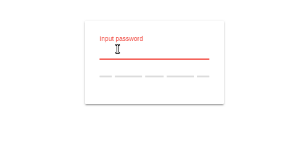

>This repository has been archived and is no longer actively maintained. While it was a valuable resource during my Angular development journey, I have since shifted my focus to React for my current and future projects. Feel free to explore the existing code, but please note that issues and pull requests will not be addressed.

[](https://github.com/eisberg-labs/ngx-strength-meter/actions/workflows/ci.yml)
[](https://codecov.io/gh/eisberg-labs/ngx-strength-meter)
[](https://www.npmjs.com/package/@eisberg-labs/ngx-strength-meter)
[](https://www.npmjs.com/package/@eisberg-labs/ngx-strength-meter)
[](https://isitmaintained.com/project/eisberg-labs/ngx-strength-meter 'Average time to resolve an issue')
[](https://www.linkedin.com/in/anamarjanica/)

# Ngx Strength Meter

> Angular widget for password strength estimation using [zxcvbn](https://github.com/dropbox/zxcvbn),
> simple and pretty.



If you 👍 this project, consider giving it a ★, thanks! 🙌

## Table of Contents

- [Installation](#installation)
- [Usage](#usage)
- [Demo](#demo)
- [API](#api)
- [Changelog](#changelog)
- [Code of Conduct](#code-of-conduct)
- [Contributing](#contributing)
- [Sponsors](#sponsors)
- [Contact](#contact)
- [License](#license)

## Installation

```bash
npm install @eisberg-labs/ngx-strength-meter --save
```

## Usage

First import to your module:

```typescript
@NgModule({
  declarations: [
    AppComponent
  ],
  imports: [
    StrengthMeterModule
  ],
  providers: [],
  bootstrap: [AppComponent]
})
export class AppModule {
}

```

And use in your component html

```html

<form [formGroup]="form" name="form">
    <mat-form-field>
        <input name="password" matInput placeholder="Input password" type="password" formControlName="password">
    </mat-form-field>
    <strength-meter [value]="form.value.password" (measure)="onStrengthChange($event)"></strength-meter>
</form>
```

## Demo

[View Demo and Documentation](https://ngx-strength-meter.amarjanica.com)

## API

### Inputs

- *value: string*: The password input for which the strength will be calculated.

### Outputs

- *measure: EventEmitter<number>*: Emits the strength score (0 to 4) when the strength is calculated. Explanations on the [meaning of grades is here](https://github.com/dropbox/zxcvbn), but you can guess that 0 is bad, 4 is good.

## Changelog

All notable changes to this project will be documented in [this file](./CHANGELOG.md).
See [Conventional Commits](https://conventionalcommits.org) for commit guidelines.

## Code of Conduct

I follow the [Rust Code of Conduct](http://www.rust-lang.org/conduct.html).

## Contributing

Everyone is welcome to contribute. You can read more about [contributing here](./CONTRIBUTING.md).

## Sponsors

If you find this project useful, give it a star. You could also consider supporting us through the following platforms:

- [Become a GitHub Sponsor](https://github.com/sponsors/amarjanica)
- [Support me on Patreon](https://www.patreon.com/amarjanica)

As this project grows, I will showcase sponsors' logos and links in this section. Thank you for your support!

## Contact

Feel free to reach out to me on [LinkedIn](https://www.linkedin.com/in/anamarjanica/).

## License

This project is [MIT licensed](./LICENSE).

